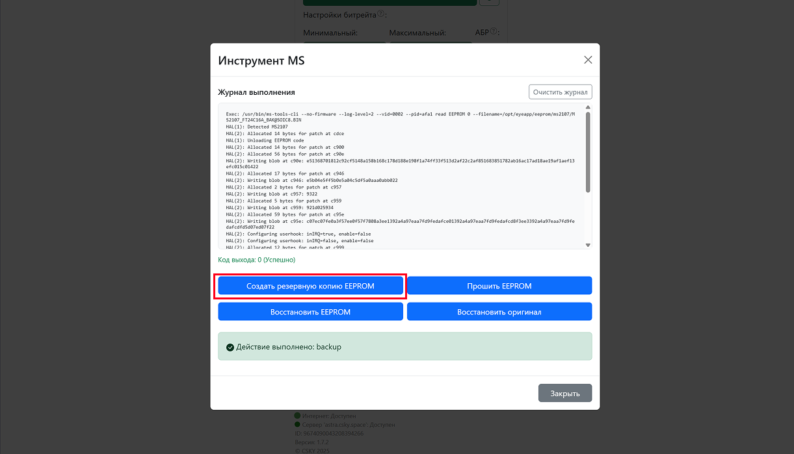

**1\.** Если есть проблема адаптера на чипе **MS2107**, когда USB устройство определяется, но пишет `YUYV` формат не найден:

[image:./proshivka.png:::0,0,99.93493819128172,100:98::2473px:1413px:center]

**2**. Переходим ниже, где сервисные кнопки и нажимаем на кнопку с иконкой `инструменты`:

[image:./proshivka-8.png:::0,7.254622414243225,99.57683384041188,78.23612407517204:::1221px:895px:center]

**3\.** Выбираем `MSTools`:

[image:./proshivka-3.png:::0,2.525832376578645,99.80481457384516,96.78530424799081:99::2487px:1410px:center]

-  В меню делаем бэкап нажав `Создать резервную копию EEPROM` . Смотрим по **журналу**, нет ли ошибок:

{width=1221px height=699px}

-  Также в этом меню прошиваем EEPROM нажав `Прошить EEPROM`. Смотрим по **журналу**, нет ли ошибок:

{width=1244px height=704px}

**4\.** Выходим из меню и **отключаем** адаптер на **3 секунды**.

**5\.** Проверяем, **подключив** адаптер снова и нажимаем стрелочку обновления. Должно определиться и без ошибки `YUYV` формата. И проверить доступность расширений кадра:

[image:./proshivka-7.png:::0,0,99.99999006751014,96.7189644746689:::2469px:1408px:center]