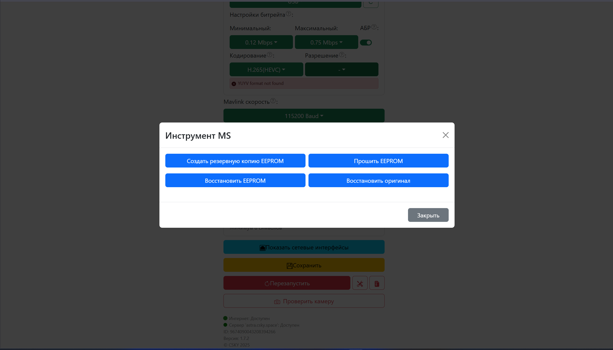
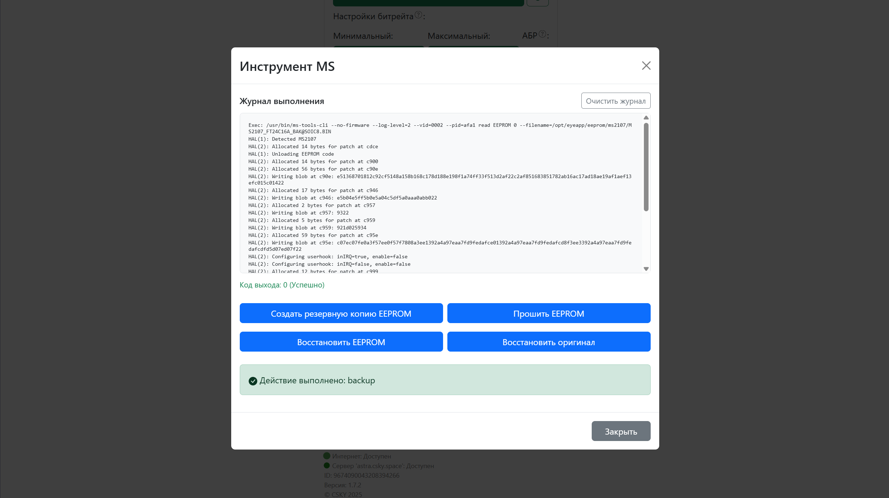
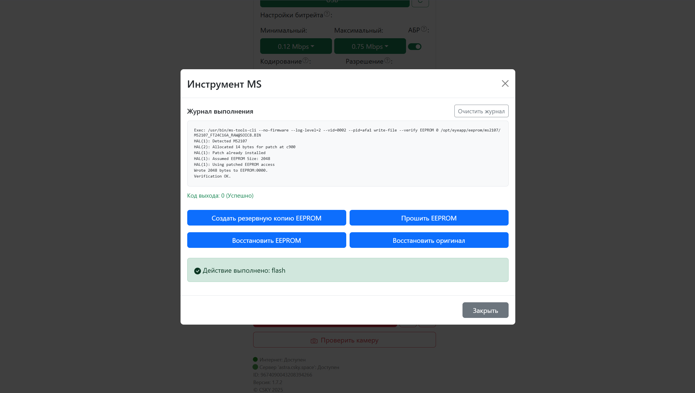
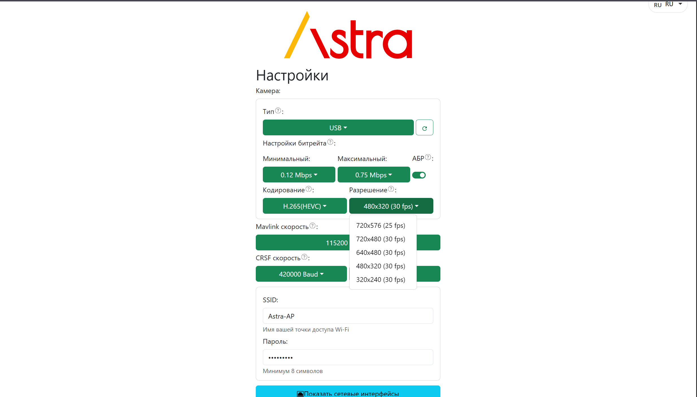

**1\.** Проблема адаптера на чипе **MS2107**. USB устройство определяется, но пишет `YUYV` формат не найден.

[image:./proshivka.png:::0,0,99.93493819128172,100:98::2473px:1413px:center]

**2**. Переходим ниже, где сервисные кнопки и нажимаем на кнопку с иконкой `инструменты`.

[image:./proshivka-2.png:::0,2.164009111617312,99.95035137360934,97.83599088838268:98::2467px:1414px:center]

**3\.** Выбираем `MSTools`

[image:./proshivka-3.png:::0,2.525832376578645,99.80481457384516,96.78530424799081:99::2487px:1410px:center]

\- В меню делаем бэкап `Создать резервную копию`. Смотрим, нет ли ошибок

{width=2488px height=1423px}

{width=2488px height=1398px}

\- В меню `Прошить EEPROM`. Смотрим, нет ли ошибок

{width=2487px height=1408px}

**4\.** Выходим из меню и отключаем адаптер на 3 секунды.

**5\.** Проверяем, подключив адаптер снова и нажимаем стрелочку обновления. Должно определиться и без ошибки `YUYV` формата. И проверить доступность расширений кадра

{width=2469px height=1408px}