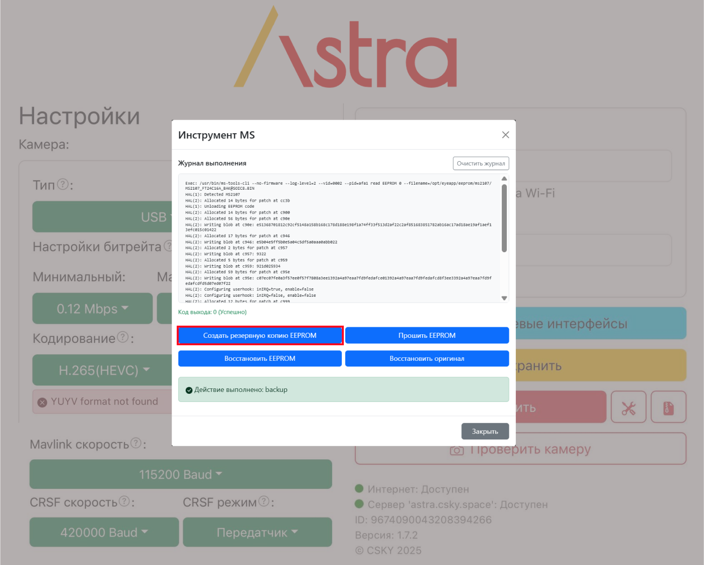
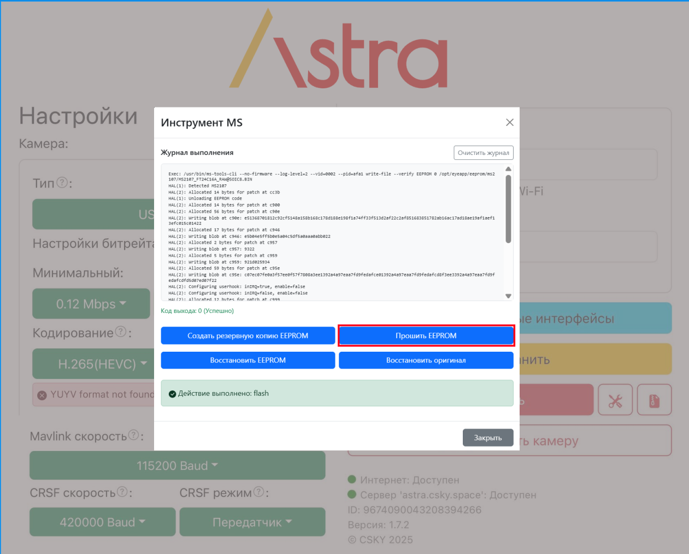
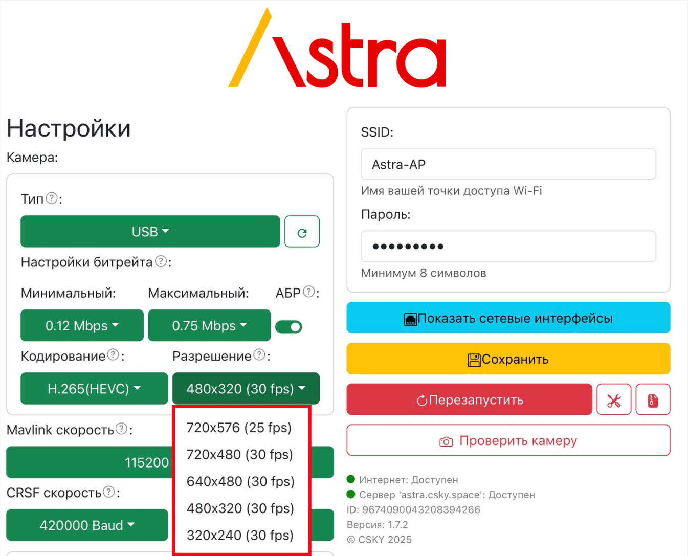

**1\.** Если есть проблема адаптера на чипе **MS2107**, когда USB устройство определяется, но пишет `YUYV` формат не найден:

{width=8842px height=7138px}

**2**. Переходим ниже, где сервисные кнопки и нажимаем на кнопку с иконкой `инструменты`:

{width=8842px height=7138px}

**3\.** Выбираем `MSTools`:

{width=1296px height=1045px}

-  В меню делаем бэкап нажав `Создать резервную копию EEPROM` . Смотрим по **журналу**, нет ли ошибок:

{width=1407px height=1129px}

-  Также в этом меню прошиваем EEPROM нажав `Прошить EEPROM`. Смотрим по **журналу**, нет ли ошибок:

{width=1261px height=1016px}

**4\.** Выходим из меню и **отключаем** адаптер на **3 секунды**.

**5\.** Проверяем, **подключив** адаптер снова и нажимаем стрелочку обновления. Должно определиться и без ошибки `YUYV` формата. И проверить доступность расширений кадра:

{width=1345px height=1087px}

