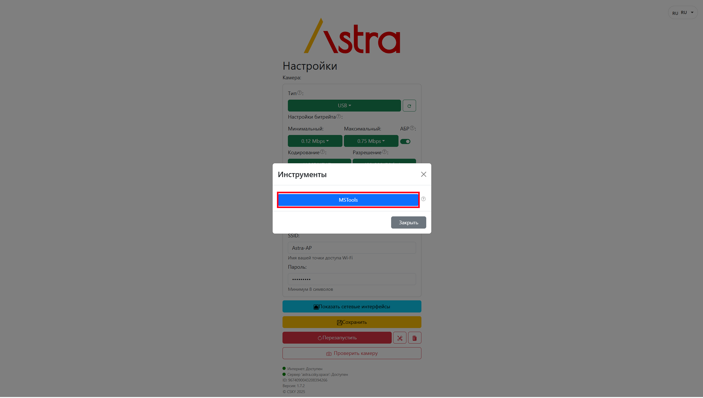
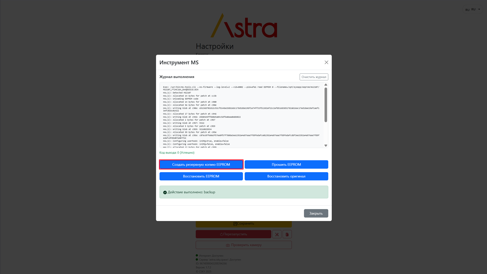
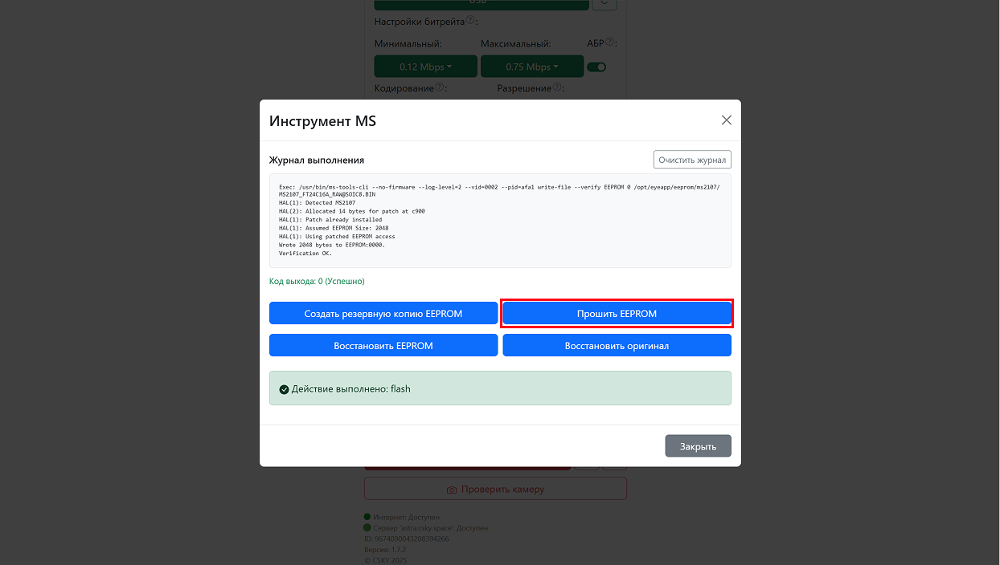

**1\.** Если есть проблема адаптера на чипе **MS2107**, когда USB устройство определяется, но пишет `YUYV` формат не найден:

{width=8842px height=7138px}

**2**. Переходим ниже, где сервисные кнопки и нажимаем на кнопку с иконкой `инструменты`:

{width=8842px height=7138px}

**3\.** Выбираем `MSTools`:

{width=3224px height=1827px}

-  В меню делаем бэкап нажав `Создать резервную копию EEPROM` . Смотрим по **журналу**, нет ли ошибок:

{width=7872px height=4436px}

-  Также в этом меню прошиваем EEPROM нажав `Прошить EEPROM`. Смотрим по **журналу**, нет ли ошибок:

{width=1244px height=704px}

**4\.** Выходим из меню и **отключаем** адаптер на **3 секунды**.

**5\.** Проверяем, **подключив** адаптер снова и нажимаем стрелочку обновления. Должно определиться и без ошибки `YUYV` формата. И проверить доступность расширений кадра:

[image:./proshivka-7.png:::0,0,99.99999006751014,96.7189644746689:::2469px:1408px:center]