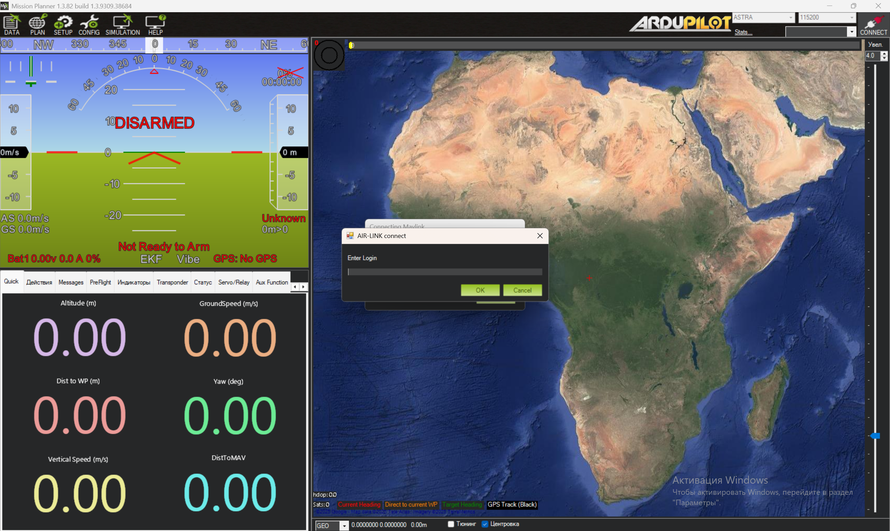
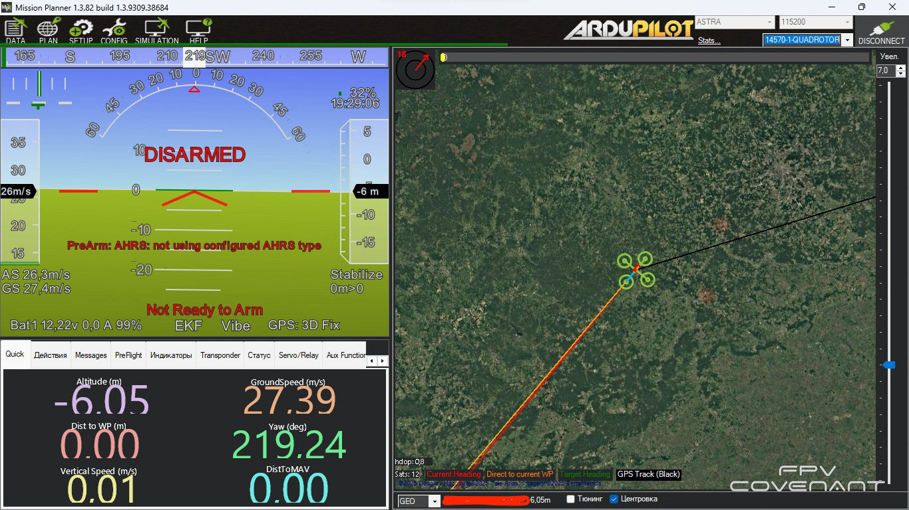

Начало работы:

-  Скачиваем [M.P.](https://ftp.air-link.space/downloads/astra/gs/AstraMP.exe) и проходим регистрацию

-  После активации и настройки системы связи ‘‘Astra’‘ заходим в M.P.. Выбираем подключение Astra и скорость которую мы указывали в настройках микрокомпьютера, после чего нажимаем Connect.

   {width=2557px height=1524px}

В открывшемся окне в поле логин вводим e-mail, указанный при регистрации в личном кабинете и пароль.

{width=1366px height=768px}