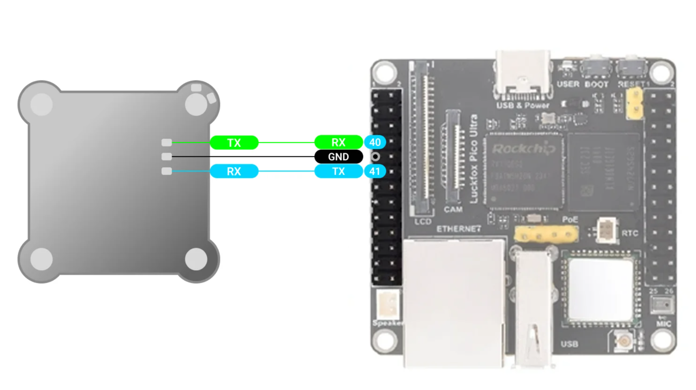

**Luckfox Pico Ultra W** -- это миниатюрная плата для разработки, работающая под управлением Linux. Она построена на чипе Rockchip RV1106 и предназначена для приложений, связанных с искусственным интеллектом. Она построена на одноядерном 32-битном **процессоре ARM Cortex-A7** со встроенными NEON и FPU, а также имеет встроенный нейронный процессор, поддерживающий смешанные операции INT4/INT8/INT16, с вычислительной мощностью до 1 тераопераций в секунду.

В нём используется новый **аппаратный ISP**, который поддерживает различные ускорители алгоритмов, такие как HDR, 3A, LSC, 3DNR, 2DNR, повышение резкости, удаление дымки, гамма-коррекция и многое другое. Оснащён встроенной 16-битной памятью DDR3L DRAM для обеспечения высокой пропускной способности памяти.

Плата для разработки поддерживает несколько интерфейсов, включая **GPIO, UART, SPI, I2C, USB** и т. д., что упрощает процесс разработки и отладки. Стоит отметить, что все платы для разработки серии LuckFox Pico поддерживают обе системы buildroot, что позволяет разработчикам выбирать подходящую систему в зависимости от требований проекта и обеспечивает большую гибкость при создании приложений.

:::info:true Общая распиновка

{width=995px height=654px}

:::

:::info:true Схема подключения передатчика канала управления

Подключите 5V GND и TX к передатчику, как показано на схеме. В настройка Luckfox необходимо задать CRSF скорость: 400000, CRSF режим: Передатчик\
Для передатчика ELRS может потребоваться убрать настройку UART inverted в режиме настройки через wifi.

{width=1584px height=985px}

:::

:::info:true Схема подключения полетного контроллера по Mavlink к Ardupilot или Inav (6 и выше)

Подключаем TX, RX и GND к полетному контроллеру, как показано на схеме. В Mission Planner устанавливаем скорость полетного контроллера: 115200 (115) и протокол MAVLink2 (2) (Config->Full Parameter list-> SerialX).\
В настройках Astra и указываем скорость Mavlink : 115200.

Также может потребоваться изменить следующие параметры:\
SYSID_MYGCS : 255\
RC_OVERRIDE_TIME : 1-3 секунды (время через которое после потери сигнала автопилот переключится на обычную связь или сработает failsafe)\
RC_OPTIONS : снимите флаг ignore MAVLink Overrides если он используется

"){width=1503px height=831px}

:::

:::info:true Схема подключение полетного контроллера по CRSF

Подключаем TX, RX и GND к полетному контроллеру, как показано на схеме.\
В настройках Astra указываем скорость CRSF: 420000; CRSF: полетный контроллер. После настройки полетного контроллера и Luckfox Pico Ultra W\
\
Для Ardupilot:

-  устанавливаем скорость полетного контроллера: 57600

-  выбираем протокол RCIN (23) ( Configex->Full Parameter list-> Serial )

   {width=1484px height=833px}

:::

:::lab:true Прошивка

Начало работы:

-  Скачать прошивку по [ссылке](https://ftp.air-link.space/downloads/astra/firmware/astra_eye_ultra_w-latest.zip)

-  Скачать [SocToolKit](https://ftp.air-link.space/downloads/astra/SocToolKit_v1.98_20240705_01_win.zip) и установить [драйвер](https://ftp.air-link.space/downloads/astra/DriverAssitant_v5.12.zip) для Windows

-  Подключите плату к компьютеру с помощью **USB Type-C кабеля** из комплекта

-  Переведите устройство в режим прошивки: Зажмите кнопку **Reset**. Не отпуская Reset, зажмите кнопку **Boot**. Отпустите **Reset**, затем отпустите **Boot**

-  Откройте **SocToolKit.exe**

-  В открывшемся окне выберите чип **RV1106**

-  В левом верхнем углу выберите интерфейс **USB**. В выпадающем списке появится устройство с меткой **"Maskrom..."** -- выберите его

-  Нажмите кнопку **Firmware...** и выберите файл прошивки update.img

-  Нажмите **Upgrade** и дождитесь завершения установки

-  После завершения прошивки **отключите питание по USB**

:::