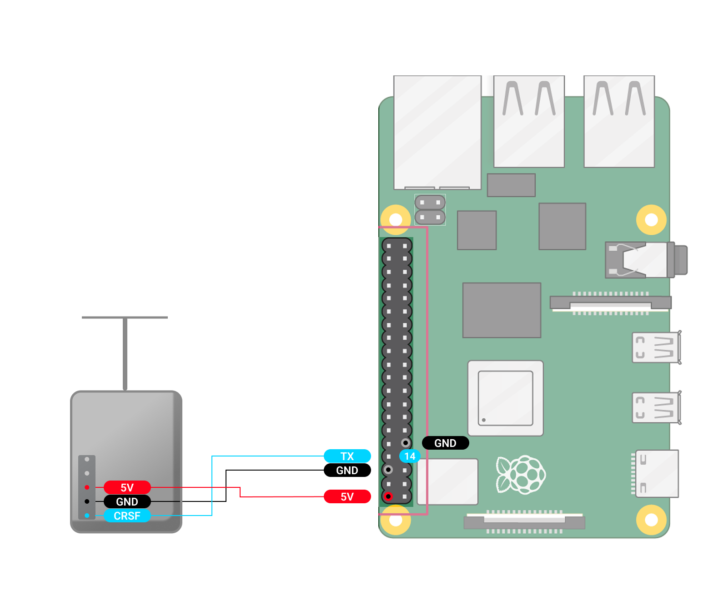

Подключите 5V GND и TX к передатчику, как показано на схеме. В настройка Luckfox необходимо задать CRSF скорость: **400000**, CRSF режим: **Передатчик**

\
Для передатчика ELRS может потребоваться убрать настройку **UART inverted** в режиме настройки через wifi.

:::info:true LuckFox Pico Ultra W

[image:./podklyuchenie-peredatchika-kanala-upravleniya-6.png:::19.254403010619132,16.020102128578852,80.72385863137505,68.71121928585774:::1568px:1133px:center]

:::

:::info:true LuckFox Pico Pro max

[image:./podklyuchenie-peredatchika-kanala-upravleniya-7.png:::18.5837510484506,12.766018883711272,81.35793336908897,73.71750120103863:::1568px:1354px:center]

:::

:::info:true Raspberry Pi 4

{width=1568px height=1354px}

:::