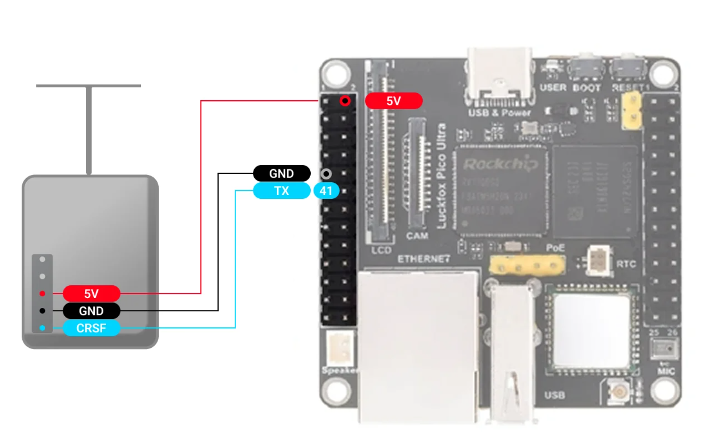

Подключите 5V GND и TX к передатчику, как показано на схеме. В настройка Luckfox необходимо задать CRSF скорость: **400000**, CRSF режим: **Передатчик**

\
Для передатчика ELRS может потребоваться убрать настройку **UART inverted** в режиме настройки через wifi.

:::info:true LuckFox Pico Ultra W

{width=1584px height=985px}

:::

