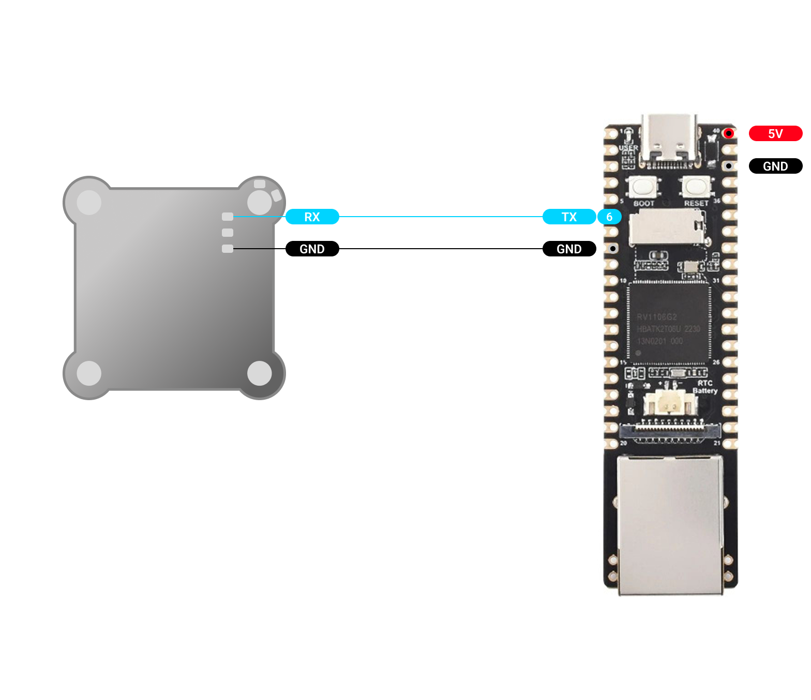
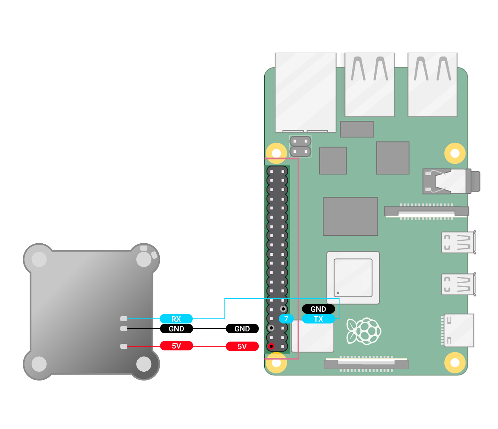
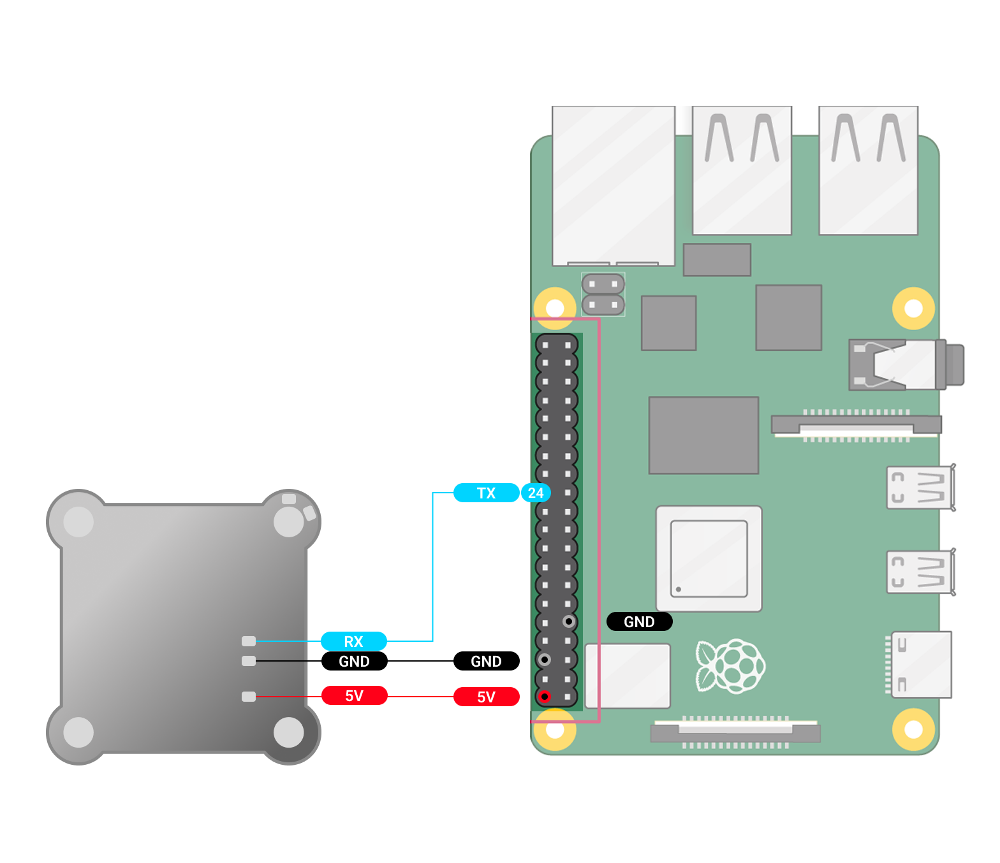

Подключаем TX, RX и GND к полетному контроллеру, как показано на схеме.\
\
В выпавшем окне Astra указываем скорость CRSF: **420000**; CRSF режим: **полетный контроллер**. После настройки полетного контроллера и Luckfox Pico Ultra W

[highlight:lemon-yellow]Для Ardupilot[/highlight]:

-  устанавливаем скорость полетного контроллера: **57600**

-  выбираем протокол **RCIN (23)** ( Config->Full Parameter list-> Serial )

[highlight:peach]Для BetaFlight[/highlight]:

-  Вкладка **Ports**->Активировать **Serial RX** для выбранного порта

-  Вкладка **Receiver**-> Receiver Mode: **Serial**->Seriak Receiver Provider: **CRSF**

   Сохранить и перезапустить

   :::info:true LuckFox Pico Ultra W

   {width=1464px height=745px}

   :::

   :::info:true LuckFox  Pico Pro max

   {width=1567px height=1008px}

   :::

   :::info:true Raspberry Pi 4

   {width=1568px height=1354px}

   :::

   :::info:true Raspberry Pi 5

   {width=1568px height=1354px}

   :::

