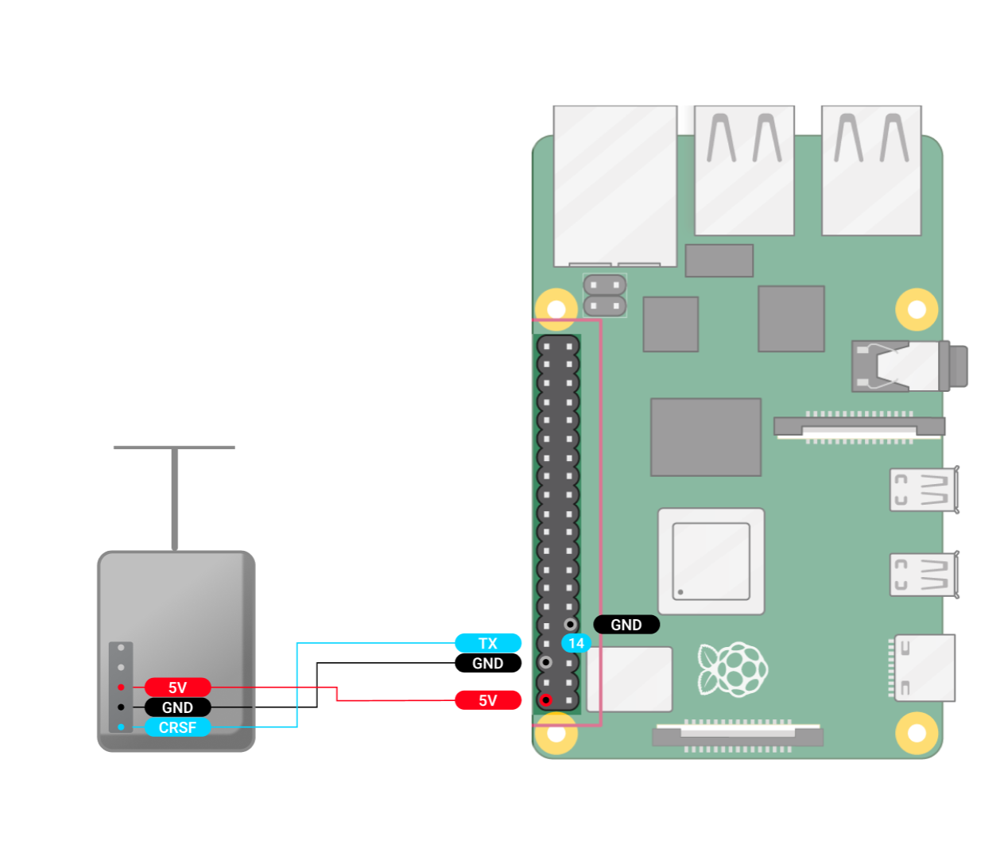

Подключаем TX, RX и GND к полетному контроллеру, как показано на схеме.\
\
В настройках Astra указываем скорость CRSF: 420000; CRSF: полетный контроллер. После настройки полетного контроллера и Luckfox Pico Ultra W\
\
Для Ardupilot:

-  устанавливаем скорость полетного контроллера: 57600;

-  выбираем протокол RCIN (23) ( Configex->Full Parameter list-> Serial ).

   :::info:true Raspberry Pi 4

   {width=1258px height=1087px}

   :::

   :::info:true LuckFox Pico Ultra W

   {width=1824px height=1055px}

   :::