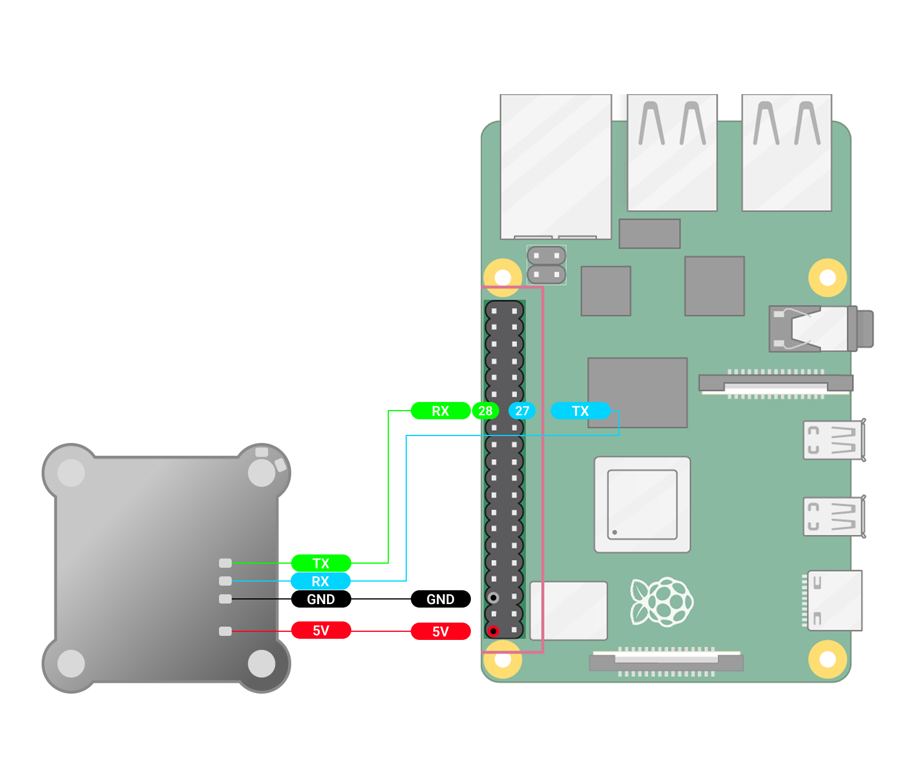
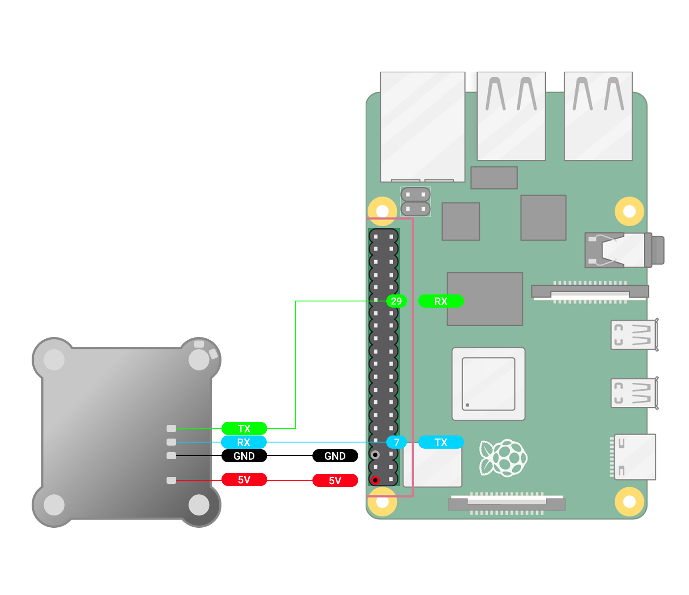

Подключаем TX, RX и GND к полетному контроллеру, как показано на схеме. В Mission Planner устанавливаем скорость полетного контроллера: **115200 (115)** и протокол **MAVLink2 (2)** (Config->Full Parameter list-> SerialX).\
В настройках Astra и указываем скорость Mavlink : **115200**.

Для настройки **Ardupilot** может потребоваться изменить следующие параметры:\
**SYSID_MYGCS : 255**\
**RC_OVERRIDE_TIME** : 1-3 секунды (время через которое после потери сигнала автопилот переключится на обычную связь или сработает failsafe)\
**RC_OPTIONS** : снимите флаг ignore MAVLink Overrides если он используется

:::info:true LuckFox Pico Ultra W

[image:./podklyuchenie-poletnogo-kontrollera-po-mavlink-k-7.png:::6.4181343368730435,17.647143751012642,93.56012730512113,68.71121928585774:::1568px:1133px:center]

:::

:::info:true LuckFox Pico Pro max

{width=1568px height=1354px}

:::

:::info:true Raspberry Pi 4

{width=1568px height=1354px}

:::

:::info:true Raspberry Pi 5

{width=1568px height=1354px}

:::

:::note:true Важно

Необходимо полетный контроллер и LuckFox Pico Ultra W должны быть настроены на одну скорость. Полетный контроллер подключаем через USB к компьютеру и в Mission Planner настроить скорость и протокол (onfigex->Full Parameter list-> Serial)

ВАЖНО: Настройка полетного контроллера осуществляется без подачи внешнего питания.

:::