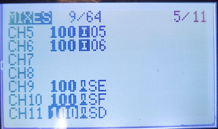

В правом верхнем углу экрана нажмите на значок геймпада

{width=1002px height=906px}

Для каждого RC канала можно выбрать ось геймпада или кнопку.

Кнопки передают значения 1000 или 2000. Оси от 1000 до 2000.

При изменении осей, они будут сохранены для конкретного модуля и пульта. 

Для пультов Radiomaster или аналогичных доступно только 8 осей. Для использования тумблеров как кнопок необходимо во вкладке MIXES установить значения для каналов 9 и выше как показано на рисунке ниже.

{width=436px height=258px}

