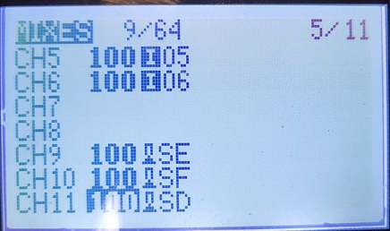

Первым шагом подключения  пульта  является установка привязки между пультом и дроном ( рассмотрен пример подключения пульта семейства Radiomaster). Для этого нужно открыть настройки пульта и найти функцию «Bind». Нажать на нее и пульт перейдет в режим привязки. Затем включить дрон и найти кнопку «Bind» на нем. Нажать на нее до тех пор, пока лампочка не начнет быстро мигать. Это будет означать, что привязка прошла успешно.

После успешной привязки пульта и дрона, необходимо настроить каналы управления. В настройках пульта нужно найти функцию «Channel map». Вам потребуется настроить соответствие каналов пульта каналам дрона. Обычно это делается путем перемещения ползунков на пульте. Убедитесь, что все каналы правильно настроены, чтобы избежать неправильного управления дроном.

Для каждого RC канала можно выбрать ось геймпада или кнопку.

Кнопки передают значения **1000 или 2000**. Оси от **1000 до 2000**.

При изменении осей, они будут сохранены для конкретного модуля и пульта.

Для пультов Radiomaster или аналогичных доступно только 8 осей. Для использования тумблеров как кнопок необходимо во вкладке **MIXES** установить значения для каналов 9 и выше как показано на рисунке ниже.

{width=436px height=258px}

После завершения настройки каналов, вы можете приступить к тестированию подключения. Установите дрон на открытое пространство, чтобы избежать помех и возможных аварий. Включите пульт и убедитесь, что он успешно подключился к дрону. Проверьте, все  ли каналы управления работают  и дрон корректно реагирует на ваши команды. Если все работает правильно, то  подключение выполнено правильно.

 В правом верхнем углу экрана нажмите на значок геймпада

{width=1002px height=906px}