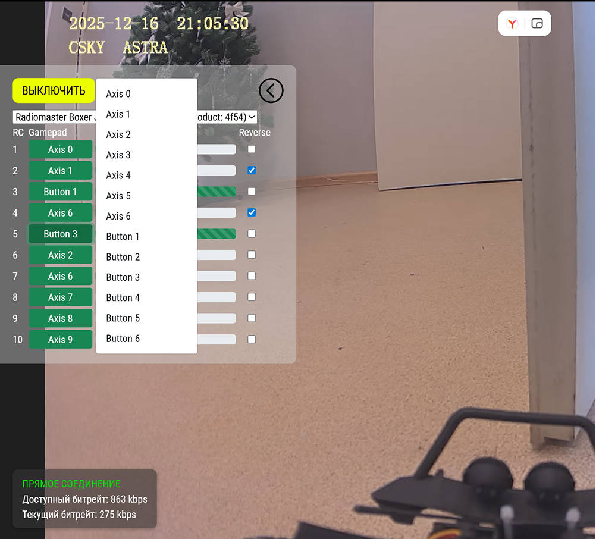

Первым шагом для подключения и настройки  пульта  является установка привязки пульта и дрона. Далее будет рассмотрен пример подключения пульта Radiomaster TX12, вид которого представлен на рисунках ниже.

[image:./podklyuchenie-pulta-3.png::Внешний вид лицевой стороны пульта:0:78::center]

[image:./podklyuchenie-pulta-4.png::Внешний вид фронтальной стороны пульта:0:78::center]

Для входа в настройки пульта нажмите и удерживайте кнопку «MDL». Во вкладке «SETUP» выберите «MULTI» и в открывшемся подменю выберите требуемый протокол из списка. Система автоматически включит соответствующий радиочастотный модуль в зависимости от выбранного Вами протокола.

Далее необходимо настроить каналы управления. В настройках пульта нужно найти функцию «Channel map». Вам потребуется настроить соответствие каналов пульта каналам дрона. Обычно это делается путем перемещения ползунков на пульте. Убедитесь, что все каналы правильно настроены, чтобы избежать неправильного управления дроном.

Для каждого RC канала можно выбрать ось геймпада или кнопку.

Кнопки передают значения **1000 или 2000**. Оси от **1000 до 2000**.

При изменении осей, они будут сохранены для конкретного модуля и пульта.

Для пультов Radiomaster или аналогичных доступно только 8 осей. Для использования тумблеров, как кнопок необходимо во вкладке **MIXES** установить значения для каналов 9 и выше как показано на рисунке ниже.

[image:./podklyuchenie-pulta-2.png:::0,0,100,100:45::436px:258px:center]

После завершения настройки каналов, вы можете приступить к тестированию подключения. Установите дрон на открытое пространство, чтобы избежать помех и возможных аварий. Включите пульт и убедитесь, что он успешно подключился к дрону. Проверьте, все  ли каналы управления работают  и дрон корректно реагирует на ваши команды. Если все работает правильно, то  подключение выполнено правильно.

В правом верхнем углу экрана нажмите на значок геймпада

{width=1002px height=906px}