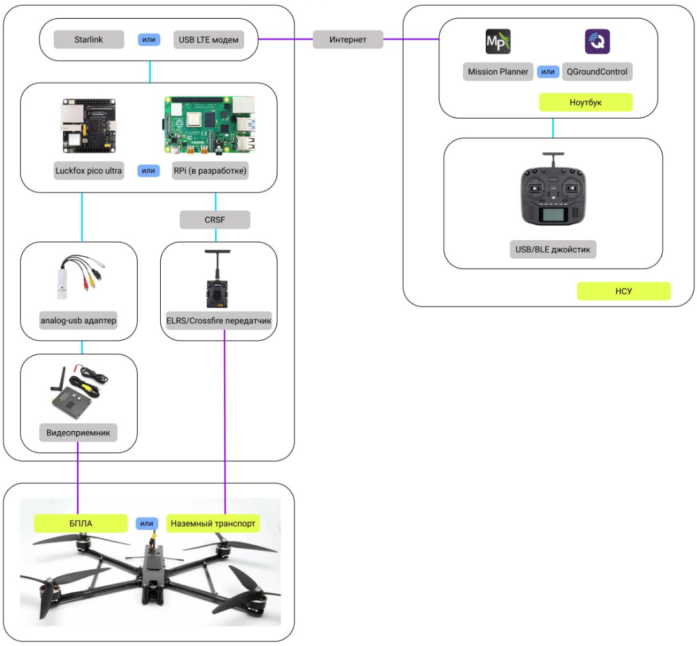
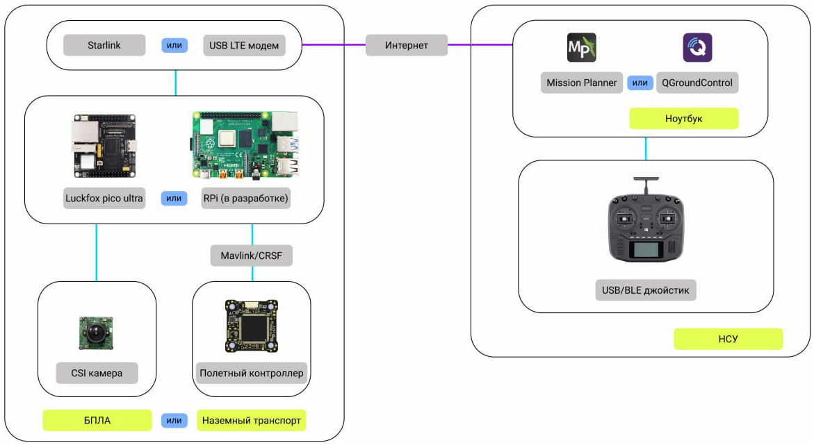

1. Удаленное управление FPV-дроном

Для реализации первого варианта потребуется:

\- 🎮Пульт;

\-💻Ноутбук;

\-📡Интернет;

\-🖥НСУ;

\-🛸FPV-дрон.

Реализация удаленного управления FPV-дроном представлена на рисунке ниже

{width=1079px height=1001px}

1. Управление БПЛА с интернетом на борту (например Starlink)

Для реализации второго варианта потребуется:

\-🎮Пульт;

\-💻Ноутбук;

\-📡🚁БПЛА с интернетом на борту

Реализация Управление БПЛА с интернетом на борту (например Starlink) представлена на рисунке ниже

{width=1171px height=641px}

1. Дрон(телега, БЭК)-матка

Для реализации третьего варианта потребуется:

\-🎮🎮🎮Пульты;

\-💻💻💻Ноутбуки;

\-📡🚁БПЛА с интернетом на борту;

\-🛸🛸🛸FPV-дроны

К источнику интернета на дроне-матке подключаются несколько плат Luckfox Pico Ultra W. Сам дрон-матка управляется по второму варианту, а FPV-дроны по первому через интернет на дроне-матке.