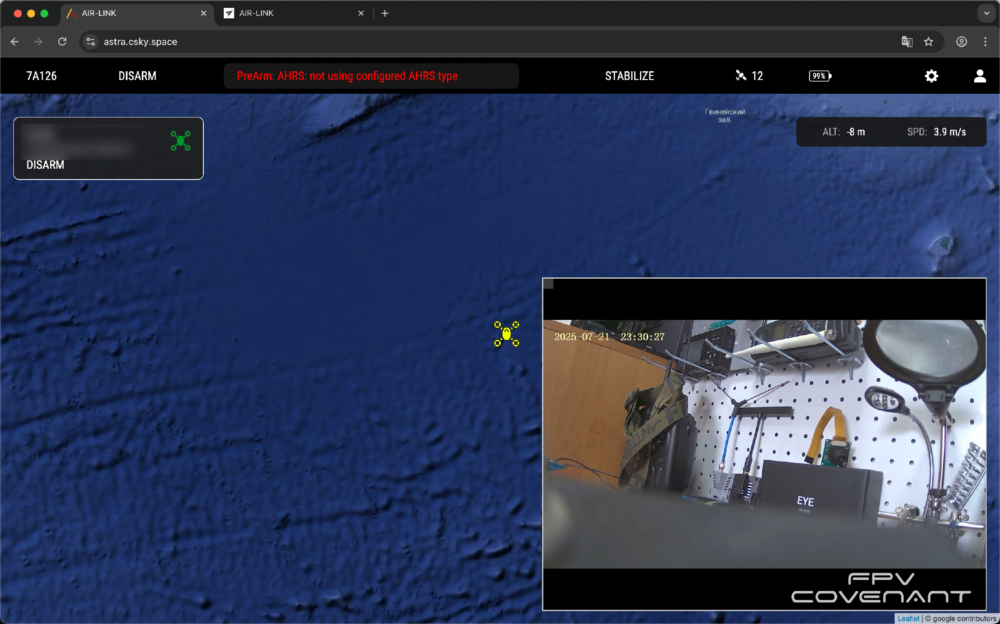

Начало работы:

-  Купить [подписку](https://csky.space/astra), после чего вам на почту приходит ключ активации;

-  Переходим в личный кабинет системы связи ["Astra"](https://astra.csky.space/login), где  проходим регистрацию.

-  Подключить одноплатный компьютер к интернету по Ethernet интерфейсу и подаем питание.

   Микрокомпьютер создаст точку доступа Wi-Fi с названием: Astra-AP и паролем: astracsky.  После подключения откроется страница с настройками.

[image:./quick-start.png::Скриншот настройки Astra (1):0,4.9786624411473115,99.89041146635633,94.8790813784359:46::720px:1280px:center]

-  Вводим ключ активации, который пришел на почту, указанной при покупке подписки, а также email и пароль от сервиса.

-  После успешной активации откроются настройки.

[image:./quick-start-2.png::Скриншот настройки Astra (2):0,0,99.4178688939509,94.07744874715262:43::720px:1280px:left]

[image:./quick-start.jpg::Скриншот настройки Astra (3) :0,0,100,100:43::746px:1280px:center]

:::lab 

Если мы используется карта захвата видеоизображения (Easycap) и аналоговая камера, то выбираем USB, если мы используем цифровую камеру через интерфейс CSI, то выбираем CSI.

:::

Заходим в личный кабинет, чтобы удостовериться в успешной активации(компьютер горит зеленым).

{width=2400px height=1498px}

