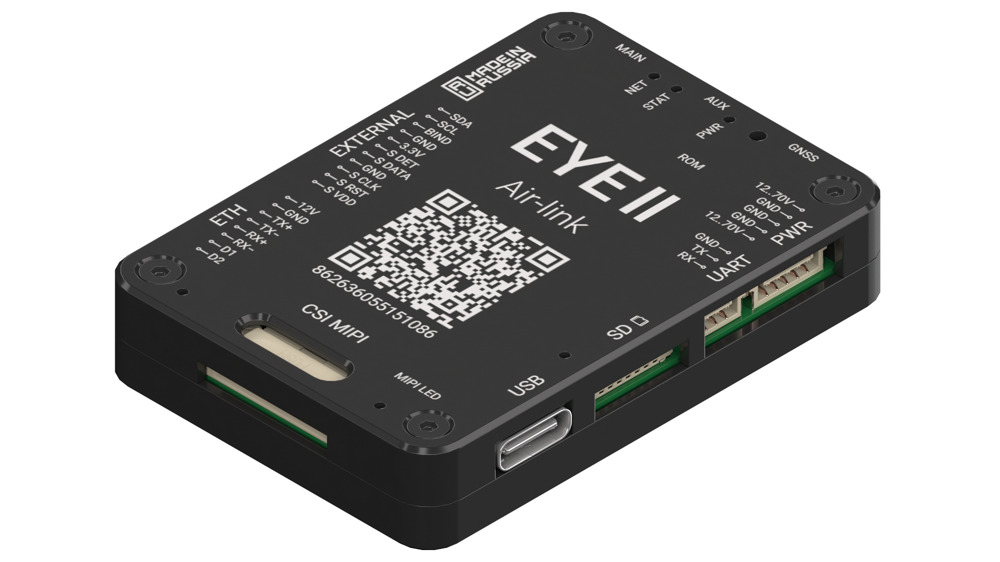

{width=1920px height=1080px}

Air-Link EYE II - это система передачи видеопотока, телеметрии и команд управления, работающая на основе сотовых сетей связи. EYE II использует современные технологии передачи данных и предназначена для организации связи между наземной станцией управления и беспилотным летательным аппаратом, а также другими роботизированными системами и системами трекинга. Модуль оснащен интерфейсами Ethernet и MIPI для подключения цифровых камер и интерфейсом UART для связи с автопилотом. В комплекте поставляется базовый внешний модуль с одной SIM-картой, опционально доступен модуль с дисплеем и двумя слотами для SIM-карт с возможностью их горячей замены.

### Характеристики



---

*  

   Напряжение питания

*  

   3S \~ 14S LiPo (12 \~ 60,9 В)

---

*  

   Средняя потребляемая мощность

*  

   5 Вт

---

*  

   Максимальная потребляемая мощность

*  

   20 Вт

---

*  

   Рабочая температура

*  

   \-40 \~ +85 °С

---

*  

   Типы разъемов антенны

*  

   MMCX

---

*  

   Формат SIM-карт

*  

   nanoSIM

---

*  

   Формат SD-карт

*  

   microSD

---

*  

   Разъемы PWR, ETH, SERIAL, SIM

*  

   JST, серия GH

---

*  

   Разъем USB

*  

   Type-C

---

*  

   Поддержка камер

*  

   MIPI, IP с кодеком H.264, H.265

---

*  

   Диапазоны частот LTE-FDD

*  

   B1/B2/B3/B4/B5/B7/B8/B12/B13/B18/B19/B20/B25/B26/B28/B66

---

*  

   LTE-TDD

*  

   B34/B38/B39/B40/B41

---

*  

   WCDMA

*  

   B1/B2/B4/B5/B6/B8/B19

---

*  

   GSM

*  

   850/900/1800/1900MHz

---

*  

   Максимальная скорость передачи данных

*  

   LTE (Mbps)

*  

   150(DL)/50(UL)

---

*  

   HSPA+ (Mbps)

*  

   42(DL)/5,76(UL)

---

*  

   WCDMA (Kbps)

*  

   384(DL)/384(UL)

---

*  

   Мощность передачи

*  

   GSM/GPRS power class

*  

   -  GSM850: 4 (33dBm)

   -  EGSM900: 4 (33dBm)

   -  DCS1800: 1 (30dBm)

   -  PCS1900: 1 (30dBm)

---

*  

   

*  

   EDGE power class

*  

   -  GSM850: E2 (27dBm)

   -  EGSM900: E2 (27dBm)

   -  DCS1800: E1 (26dBm)

   -  PCS1900: E1 (26dBm)

---

*  

   

*  

   UMTS power class

*  

   WCDMA: 3 (24dBm)

---

*  

   

*  

   LTE power class

*  

   3 (24dBm)

---

*  

   Антенны

*  

   -  Основная GSM/UMTS/LTE

   -  Разнесенная UMTS/LTE

   -  Антенна GNSS

*  

   

---

*  

   Габаритные размеры

*  

   41 × 58 × 11 мм

---

*  

   Масса

*  

   80 г


