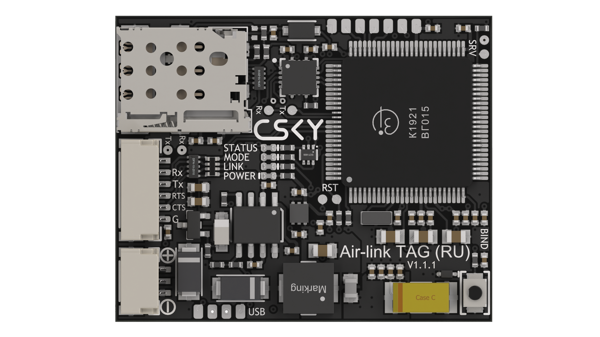

{width=1920px height=1080px}

Компактный 4G/LTE модем телеметрии для автопилота с функцией удаленной идентификации (*обязательна с 1 марта 2025 года в соответствии с постановлением правительства 1701 от 30.11.2024*) на основе отечественного микроконтроллера К1921ВГ015 АО «НИИЭТ» и  модуля ПР1603Н производства «НИИМА «Прогресс». Модем использует стандартный протокол Mavlink для связи с полетным контроллером, оснащен разнесенной антенной, GNSS и защитой питания.

### Характеристики



---

*  Диапазон частот

*  GSM/GPRS/EDGE B3/B8

   FDD-LTE: B3/B7/B20

   TDD-LTE: B38

---

*  GNSS

*  Поддержка GPS, ГЛОНАСС, BeiDou и Galileo. Поддержка многосистемного совместного позиционирования. Поддержка приема и обработки нескольких сигналов SBAS

---

*  Скорость передачи

*  По радиоканалу: передача 5 Мбит/c, прием 10 Мбит/с

   Между полетным контроллером и AIRLINK: до 115200 бод/с

---

*  Прошивка автопилота

*  PX4, Ardupilot или INAV

---

*  Тип SIM-карты

*  nanoSIM

---

*  Интерфейс

*  Full UART 3,3

---

*  Поддержка протоколов

*  Mavlink1, Mavlink2

---

*  Напряжение питания

*  От 4,7 до 28 В

---

*  Макс. потребляемая мощность

*  Не более 10 Вт

---

*  Габаритные размеры

*  8,5 × 32,5 × 40 мм

---

*  Масса

*  12 г

---

*  Разъем антенны

*  U.FL


