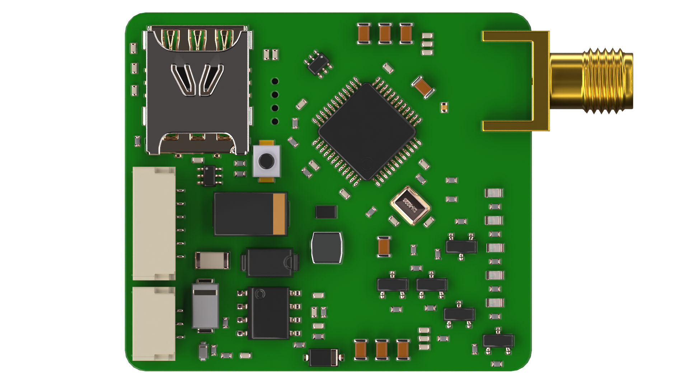

{width=1920px height=1080px}

4G/LTE модем телеметрии для автопилота на основе микроконтроллера STM32F103 и модуля связи SIMCOM A7600E. Модем использует стандартный протокол Mavlink для связи с полетным контроллером.

### Характеристики



---

*  Диапазон частот

*  LTE-TDD: B38/B40\
   TE-FDD: B1/B3/B5/B7/B8/B20\
   GSM/GPRS/EDGE 900/1800 МГц

---

*  Скорость передачи

*  По радиоканалу: передача: 5 Мбит/c, прием: 10 Мбит/с Между полетным контроллером и AIRLINK: до 115200 бод/с

---

*  Прошивка автопилота

*  PX4, Ardupilot или INAV

---

*  Тип SIM-карты

*  nanoSIM

---

*  Поддержка протоколов

*  Mavlink1, Mavlink2

---

*  Интерфейс

*  Full UART 3,3 В

---

*  Напряжение питания

*  5 - 28 В

---

*  Макс. потребляемая мощность

*  5 Вт

---

*  Габаритные размеры

*  8 × 35 × 52 мм

---

*  Масса

*  13 г

---

*  Разъем антенны

*  SMA


