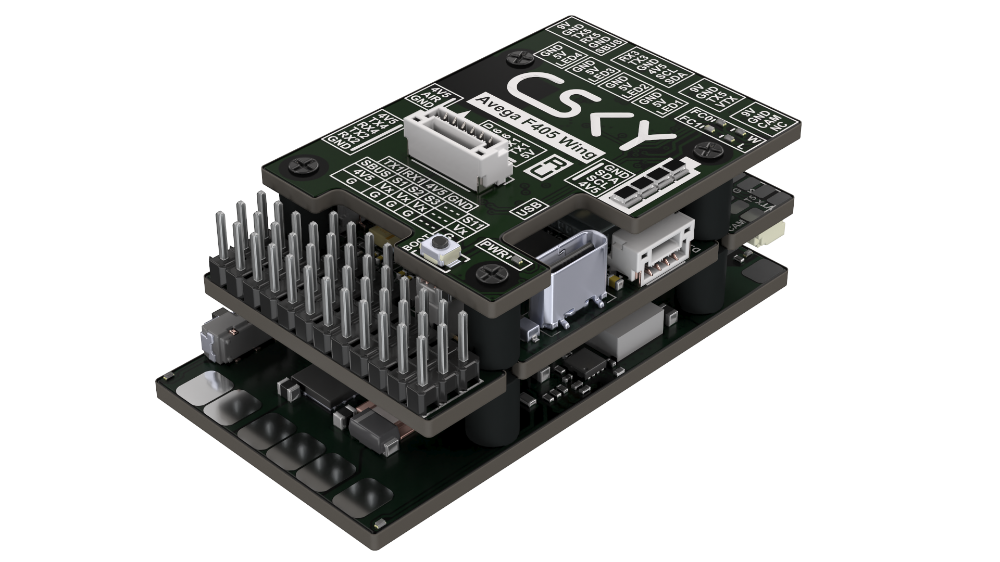

{width=1920px height=1080px}

Avega F405 WING - компактный полётный контроллер с полным набором необходимой периферии. Имеет 11 независимых выходов на моторы, благодаря чему подходит для сложных планерных схем, включая конструкции VTOL. Полетный контроллер оснащен системой плавной подачи питания без бросков тока, специальный переключатель полностью отключает питание борта, предотвращая разряд батареи и нежелательный нагрев в простое. На плате распределения питания также установлены регулируемые BEC для VTX и сервоприводов и встроенная TVS-защита от скачков напряжения. Плата беспроводной связи дает возможность настроить полетный контроллер через Wi-Fi или BLE без использования кабелей и непосредственного доступа к полетному контроллеру.

## Характеристики



---

*  

   **FCB**

   **(плата полетного контроллера)**

*  

   MCU

*  

   STM32F405, 168 МГц, 1 МБ Flash

---

*  

   IMU (гироскоп и акселерометр)

*  

   ICM-42688-P (опц. ICM-45686)

---

*  

   Барометр

*  

   BMP390

---

*  

   OSD-чип

*  

   AT7456E

---

*  

   Черный ящик

*  

   слот для карты MicroSD

---

*  

   UART

*  

   6 портов (UART1–UART6, UART6 выделен для телеметрии беспроводного модуля)

---

*  

   I2C

*  

   1

---

*  

   ADC

*  

   4

---

*  

   PWM

*  

   11

---

*  

   Приемник ELRS/CRSF

*  

   поддерживается, подключение к UART1

---

*  

   SBUS

*  

   встроенный инвертор для входа SBUS (UART2-RX)

---

*  

   RSSI

*  

   поддерживается (обозначен как RSSI)

---

*  

   Поддерживаемая прошивка

*  

   INAV, Pixhawk (target: AVEGAF405WING)

---

*  

   Масса

*  

   12 г

---

*  

   **PDB**

   **(плата распределения питания)**

*  

   Диапазон входного напряжения

*  

   7 - 26 В (2S - 6S LiPo)

---

*  

   Датчик напряжения батареи

*  

   есть, делитель 1:10

---

*  

   Датчик тока батареи

*  

   есть, коэффициент токового датчика 15 мВ/А (66,67 А/В)

---

*  

   Ток нагрузки

*  

   120 А продолжительный, 280 А пиковый

---

*  

   TVS-защитный диод

*  

   есть

---

*  

   BEC для FC

*  

   5,2±0,1 В / 2,5 А постоянно, 3 А пик

---

*  

   BEC для VTX

*  

   9±0,1 В / 1,8 А постоянно, 2,3 А пик (регулируется перемычкой: 9 В по умолчанию, 12 В или 5 В)

---

*  

   BEC для сервоприводов

*  

   5±0,1 В / 5 А постоянно, 5,5 А пик (регулируется: 4,9 В по умолчанию, 6 В или 7,2 В)

---

*  

   Функция плавного пуска

*  

   есть

---

*  

   Функция отключения питания

*  

   есть (переключатель)

---

*  

   Масса

*  

   14 г

---

*  

   **WCB**

   **(плата беспроводной связи)**

*  

   Беспроводная настройка

*  

   режим BLE или Wi-Fi (подключение к MissionPlanner и INAV Configurator через DroneBridge)

---

*  

   Контроллер LED-ленты

*  

   4 разъёма для WS2812, макс 5,2 В / 1,3 А, поддержка до 70 светодиодов WS2812 (5050)

---

*  

   LED

*  

   2 светодиода состояния (синий, зелёный) + индикатор 3,3 В (красный)

---

*  

   Индикатор уровня батареи

*  

   4 RGB-светодиода (уровень отображается количеством горящих диодов)

---

*  

   Масса

*  

   6 г

---

*  

   **Общие характеристики**

*  

   Габаритные размеры

*  

   59 × 32 × 22 мм

---

*  

   Масса

*  

   36 г


