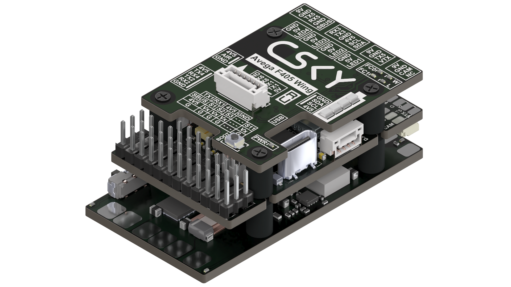

{width=1920px height=1080px}

Avega F405 Wing - готовое решение для пилотов, которые ищут мощный, но компактный полётный контроллер с полным набором необходимой периферии. Благодаря 11 независимым выходам на моторы, он идеально подходит для сложных планерных схем, включая конструкции VTOL. Встроенная система плавной подачи питания обеспечивает мягкий запуск электроники без бросков тока, защищая чувствительные компоненты, а специальный переключатель полностью отключает питание борта, предотвращая разряд батареи и нежелательный нагрев в простое. Кроме того, с платой распределения питания вы получаете регулируемые BEC для VTX и сервоприводов, а также встроенную TVS-защиту от скачков напряжения - всё, что нужно для стабильного и безопасного полёта. А плата беспроводной связи дает возможность настроить полетный контроллер без использования кабелей и непосредственного доступа к полетному контроллеру через Wi-Fi или BLE.

## Характеристики



---

*  

   FCB

*  MCU

*  STM32F405, 168 МГц, 1 МБ Flash

---

*  IMU (гироскоп и акселерометр)

*  ICM-42688-P (опц. ICM-45686)

---

*  Барометр

*  BMP390

---

*  OSD-чип

*  AT7456E

---

*  Черный ящик

*  слот для карты MicroSD

---

*  UART

*  6 портов (UART1–UART6, UART6 выделен для телеметрии беспроводного модуля)

---

*  I2C

*  1

---

*  ADC

*  4

---

*  PWM

*  11

---

*  Приемник ELRS/CRSF

*  поддерживается, подключение к UART1

---

*  SBUS

*  встроенный инвертор для входа SBUS (UART2-RX)

---

*  RSSI

*  поддерживается (обозначен как RSSI)

---

*  Поддерживаемая прошивка

*  INAV, Pixhawk (target: AVEGAF405WING)

---

*  Вес

*  12 г

---

*  

   PDB

*  Диапазон входного напряжения

*  7–26 В (2–6S LiPo)

---

*  Датчик напряжения батареи

*  есть, делитель 1:10

---

*  Датчик тока батареи

*  есть, коэффициент токового датчика 15 мВ/А (66,67 А/В)

---

*  Ток нагрузки

*  120 А продолжительный, 280 А пиковый

---

*  TVS-защитный диод

*  есть

---

*  BEC для FC

*  5\.2 В ±0,1 В, 2,5 А постоянно, 3 А пик

---

*  BEC для VTX

*  9 В ±0,1 В, 1,.8 А постоянно, 2.3 А пик (регулируется перемычкой: 9В по умолчанию, 12В или 5В)

---

*  BEC для сервоприводов

*  5 В ±0,1 В, 5 А постоянно, 5.5 А пик (регулируется: 4.9В по умолчанию, 6В или 7.2В)

---

*  Функция плавного пуска

*  есть

---

*  Функция отключения питания

*  есть (переключатель)

---

*  Вес

*  14 г

---

*  

   WCB

*  Беспроводная настройка

*  режим BLE или Wi-Fi (подключение к MissionPlanner и INAV Configurator через DroneBridge)

---

*  Контроллер LED-ленты

*  4 разъёма для WS2812, макс 5.2В 1.3А, поддержка \~70 светодиодов WS2812 (5050)

---

*  LED

*  2 светодиода состояния (синий, зелёный) + индикатор 3.3В (красный)

---

*  Индикатор уровня батареи

*  4 RGB-светодиода (уровень отображается количеством горящих диодов)

---

*  Вес

*  6 г

---

*  

   Общее

*  Габариты

*  59 × 32 × 22 мм

---

*  Вес

*  36 г


