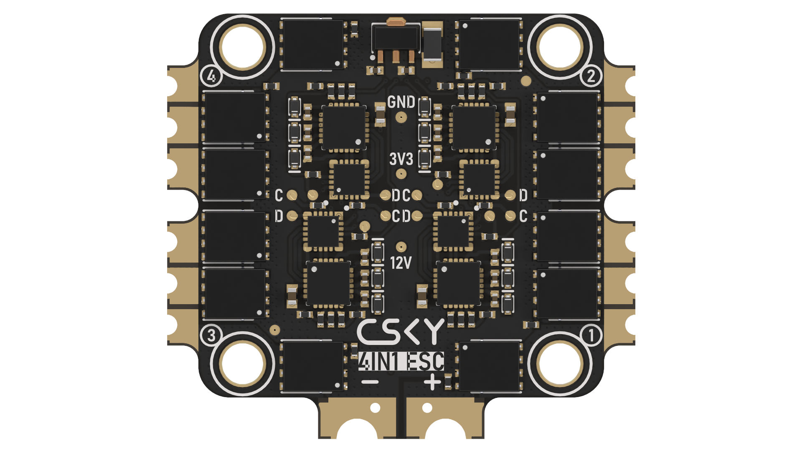

{width=1920px height=1080px}

{width=1920px height=1080px}

Стек для FPV-дронов, который состоит из платы полетного контроллера (FC) и платы регулятора оборотов (ESC). Стек выполняет функцию системы управления FPV-дрона в полуавтоматическом и автоматическом режимах, а также функцию управления бесколлекторными моторами.

### Характеристики

#### Общие



---

*  Напряжение питания

*  11 - 26 В (3 - 6 S LiPo)

---

*  Прошивки

*  Поставляется с Betaflight, также доступны INAV и Ardupilot

---

*  Присоединительные размеры

*  По радиоканалу: передача 5 Мбит/c, прием 10 Мбит/с

   Между полетным контроллером и AIRLINK: до 115200 бод/с

---

*  Габаритные размеры

*  42 × 45 × 15 мм

---

*  Масса

*  29 г



#### Полетный контроллер



---

*  

   Микроконтроллер

*  

   STM32F427ZGT6 (опционально К1921ВК01Т2 АО «НИИЭТ» на прошивке Betaflight)

---

*  

   Прошивки

*  

   Поставляется с Betaflight, также доступны INAV и Ardupilot

---

*  

   Датчик ИНС (акселерометр и датчик угловых скоростей)

*  

   MPU6000

---

*  

   Барометр

*  

   BMP390

---

*  

   Разъем USB

*  

   USB Type-C

---

*  

   Вход для датчика тока

*  

   Контакт CUR или C для 8-контактного разъема ESC

---

*  

   Выход для управления моторами

*  

   1-4 для 8-контактного разъема ESC, М6-М8 под пайку

---

*  

   Вход питания

*  

   GND, V для 8-контактного разъема ESC, контакты BAT, GND под пайку

---

*  

   Выход 5 В

*  

   9 контактных площадок с защитой от КЗ на 2,6 А (самовосстанавливающийся предохранитель)

---

*  

   UART

*  

   В Betaflight доступны 6 UART (1 - 6), в Ardupilot и INAV доступны все 8 UART

---

*  

   I2C

*  

   Контакты SCL и SDA

---

*  

   ESC телеметрия

*  

   UART7 RX для 8-контактного разъема ESC, UART4 RX под пайку

---

*  

   Кнопка BOOT

*  

   Используется для загрузки в режиме DFU. Для этого зажмите кнопку BOOT и подайте питание. Для загрузки прошивки рекомендуется использовать ПО STM32CubeProgrammer.

---

*  

   Сервоприводы

*  

   По умолчанию контакты S1 и S2

---

*  

   Логические выходы PINIO

*  

   По умолчанию контакты S5, S6, S7, S8

---

*  

   Габаритные размеры

*  

   41 × 41 × 7 мм

---

*  

   Масса

*  

   10 г



#### Регулятор оборотов



---

*  Прошивка

*  Поставляется с BLHeli_S J-H-40, также доступна прошивка BlueJay

---

*  Ссылка на конфигуратор

*  <https://esc-configurator.com/>

---

*  Сила тока

*  55 A × 4

---

*  Пиковая сила тока

*  65 A (10 с)

---

*  Датчик тока

*  Встроенный

---

*  Вход питания

*  Контакты V и GND

---

*  Протокол

*  PWM, DSHOT150, DSHOT300, DSHOT600

---

*  Внешний конденсатор

*  1000 мкФ, 35 В с низким внутренним сопротивлением

---

*  Габаритные размеры

*  42 × 25 × 6,5 мм

---

*  Масса

*  20 г


