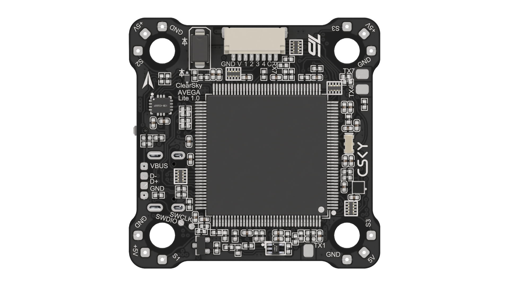

{width=1920px height=1080px}

{width=1920px height=1080px}

Стек для FPV-дронов, который состоит из платы полетного контроллера (FC) и платы регулятора оборотов (ESC). Стек выполняет функцию системы управления FPV-дрона в полуавтоматическом и автоматическом режимах, а также функцию управления бесколлекторными моторами.

### Характеристики

#### Общие



---

*  Напряжение питания

*  11 - 26 В

---

*  Прошивки

*  Поставляется с Betaflight, также доступны INAV и Ardupilot

---

*  Присоединительные размеры

*  По радиоканалу: передача 5 Мбит/c, прием 10 Мбит/с

   Между полетным контроллером и AIRLINK: до 115200 бод/с

---

*  Габаритные размеры

*  42 × 45 × 15 мм

---

*  Масса

*  29 г



#### Полетный контроллер



---

*  Микроконтроллер

*  STM32F427ZGT6 (опционально К1921ВК01Т2 АО «НИИЭТ» на прошивке Betaflight)

---

*  Прошивки

*  Поставляется с Betaflight, также доступны INAV и Ardupilot

---

*  Датчик ИНС (акселерометр и датчик угловых скоростей)

*  MPU6000

---

*  Барометр

*  BMP390

---

*  Разъем USB

*  USB Type-C

---

*  Вход для датчика тока

*  пин CUR или C для 8-ми контактного разъема ESC

---

*  Выход для управления моторами

*  1-4 для 8-ми контактного разъема ESC, М6-М8 под пайку

---

*  Вход питания

*  GND, V для 8-контактного разъема ESC, контакты BAT, GND под пайку

---

*  Выход 5 В

*  9 контактных площадок с защитой от КЗ на 2,6 А (самовосстанавливающийся предохранитель)

---

*  UART

*  В Betaflight доступны 6 UART (1-6). В Ardupilot и INAV доступны все 8 UART

---

*  I2C

*  Контакты SCL и SDA

---

*  ESC телеметрия

*  UART7 RX для 8-ми контактного разъема ESC, UART4 RX под пайку

---

*  Прошивки

*  Поставляется с Betaflight, также доступны INAV и Ardupilot

---

*  Кнопка BOOT

*  Используется для загрузки в режиме DFU. Для этого зажмите кнопку BOOT и подайте питание. Для загрузки прошивки рекомендуется использовать ПО STM32CubeProgrammer.

---

*  Сервоприводы

*  По умолчанию пины S1 и S2

---

*  Логические выходы PINIO

*  По умолчанию пины S5, S6, S7, S7

---

*  Габаритные размеры

*  41 × 41 × 7 мм

---

*  Масса

*  10 г



#### Регулятор оборотов



---

*  Прошивка

*  Поставляется с BLHeli_S J-H-40, также доступна прошивка BlueJay

---

*  Ссылка на конфигуратор

*  <https://esc-configurator.com/>

---

*  Сила тока

*  55 A × 4

---

*  Пиковая сила тока

*  65 A (10 с)

---

*  Датчик тока

*  встроенный

---

*  Вход питания

*  контакты V и GND

---

*  Протокол

*  PWM, DSHOT150, DSHOT300, DSHOT600

---

*  Внешний конденсатор

*  1000 мкФ, 35 В с низким внутренним сопротивлением

---

*  Габаритные размеры

*  42 × 25 × 6,5 мм

---

*  Масса

*  20 г


