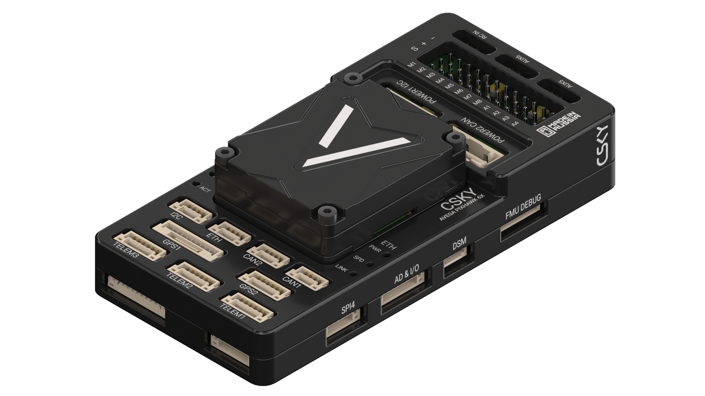

{width=1920px height=1080px}

Avega Pixhawk 6X - это промышленный полетный контроллер для профессиональных БПЛА, разработанный в соответствии с международным стандартом автопилота Pixhawk FMUv6X DS-012 и DS-010. Контроллер оснащён высокопроизводительным процессором STM серии H7, модульной конструкцией с тройным резервированием инерциальных датчиков, виброизолированной платой IMU с термостабилизацией, независимыми доменами питания и коммуникации и широчайшим набором интерфейсов, что обеспечивает высокую производительность, надёжность и гибкость в настройке и эксплуатации.

### Области применения

Avega Pixhawk 6X подходит для решения широкого спектра задач, от земледелия и логистики до инспекции, картографии и научных исследований.

### Характеристики



---

*  

   **Процессоры**

*  

   FMU-процессор

*  

   STM32H753

   32 Bit Arm® Cortex®-M7, 480MHz, 2MB flash memory, 1MB RAM

---

*  

   IO-сопроцессор

*  

   STM32F103

   32 Bit Arm® Cortex®-M3, 72MHz, 64KB SRAM

---

*  

   **Встроенные датчики**

*  

   Акселерометр / гироскоп 1

*  

   ICM-45686 (с технологией BalancedGyro™) или BMI088

---

*  

   Акселерометр / гироскоп 2

*  

   ICM-45686 (с технологией BalancedGyro™)

---

*  

   Акселерометр / гироскоп 3

*  

   ICM-42670-P

---

*  

   Барометр 1

*  

   ICP20100

---

*  

   Барометр 2

*  

   BMP390

---

*  

   Магнетометр

*  

   BMM150

---

*  

   **Напряжение питания**

*  

   Максимальное напряжение питания

*  

   6 В

---

*  

   Напряжение питания USB

*  

   4,75 - 5,25 В

---

*  

   Входное питание сервоприводов

*  

   0 - 36 В

---

*  

   **Ограничения тока**

*  

   Ограничение тока порта Telem1

*  

   1,5 A

---

*  

   Ограничение тока для остальных портов в сумме

*  

   1,5 A

---

*  

   **Габаритные размеры**

*  

   Полетный контроллер

*  

   38,8 × 31,8 × 15,5 мм

---

*  

   Модуль коммутации

*  

   47,5 × 97,5 × 17,4 мм

---

*  

   **Масса**

*  

   Полетный контроллер

*  

   30 г

---

*  

   Модуль коммутации

*  

   65 г

---

*  

   Общая

*  

   105 г

---

*  

   **Внешние интерфейсы**

*  

   16 ШИМ-выходов (3,3 В)

---

*  

   1 R/C вход для Spektrum / DSM

---

*  

   1 Выделенный R/C вход для PPM и S.Bus

---

*  

   1 Выделенный аналоговый / PWM RSSI вход и S.Bus выход

---

*  

   1 Выделенный R/C вход для PPM и S.Bus

---

*  

   4 порта GPIO

*  

   -  3 с поддержкой flow control

   -  1 с ограничением по току 1,5 A (Telem1)

   -  1 с I2C и дополнительной линией GPIO для внешнего NFC приемника

---

*  

   2 GPS-порта

*  

   -  1 полный GPS порт с Safety Switch

   -  1 базовый GPS порт

---

*  

   1 I2C-порт

---

*  

   1 Ethernet-порт

*  

   -  Безтрансформаторное применение

   -  Скорость до 100Mbps

---

*  

   1 SPI-шина

*  

   -  2 линии CS

   -  2 линии Data Ready

   -  1 SPI reset линия

   -  1 SPI SYNC линия

---

*  

   2 CAN-шины

---

*  

   2 порта питания

*  

   -  1 порт I2C

   -  1 порт CAN

---

*  

   1 AD&IO-порт

*  

   -  2 дополнительных аналоговых входа

   -  1 PWM/Capture вход

   -  2 выделенных порта отладки

---

*  

   **Рабочая температура**

*  

   от -40 до +85 °C


