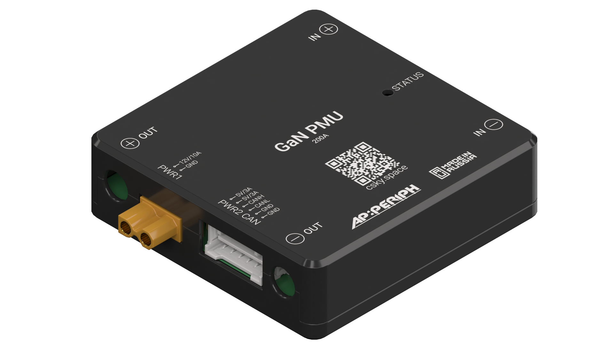

{width=819px height=576px}

GaN PMU -- это модуль мониторинга и управления питанием БПЛА со встроенным микроконтроллером STM32F4 и двумя понижающими преобразователями с высоким КПД: 12В/10А (на основе GaN-транзисторов) и 5В/3А. Для связи с полетным контроллером модуль использует стандартный протокол DroneCAN.

### Характеристики



---

*  Процессор

*  STM32F412

---

*  Входное напряжение

*  10S – 14S

---

*  Максимальный ток нагрузки

*  200A

---

*  Максимальный измеряемый ток нагрузки

*  1000A

---

*  Точность измерения напряжения

*  ±0,1%

---

*  Точность измерения тока

*  ±0,1%

---

*  Порт XT30PW-F

*  12В/10А

---

*  Порт 502494-0670

*  5В/3А

---

*  Интерфейс

*  DroneCAN

---

*  Калибровка

*  не требуется

---

*  Разъемы IN/OUT:

*  кабель

---

*  Разъем 12V:

*  XT30PW-F

---

*  Разъем CAN:

*  502494-0670

---

*  Габариты (без кабелей)

*  57,5 х 57,5 х 17,1 мм

---

*  Вес: (без кабелей)

*  90 г



**Рекомендации:**

-  Не использовать с батареями ниже 10S

-  Не использовать с высокоемкостной нагрузкой

-  Не использовать в герметичном корпусе